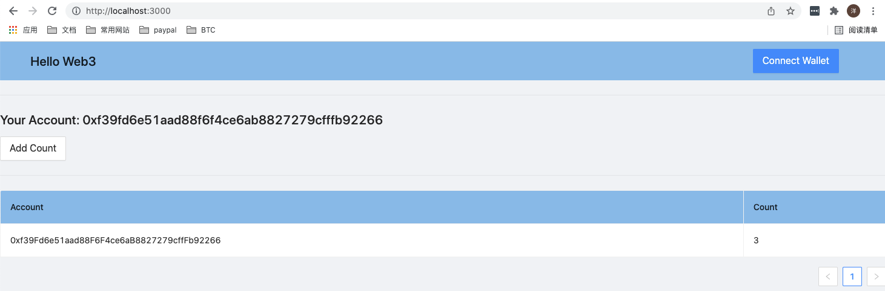
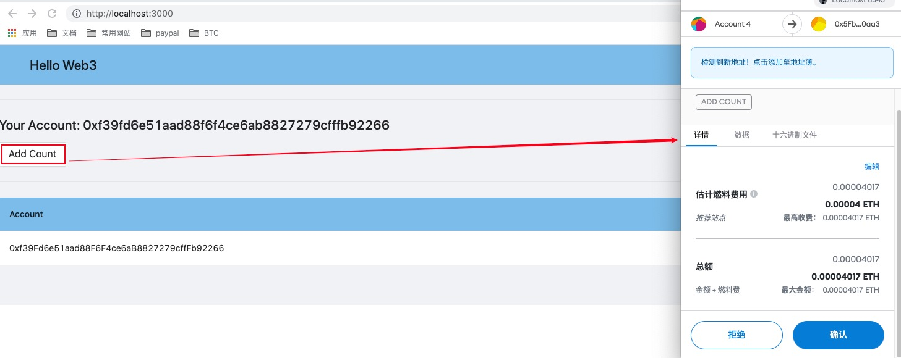

# hello-web3

## 介绍
这个是一个Web3入门的Demo Dapp，主要包括了以下几个方面

1. 编写一个简单的solidity合约
2. 利用hardhat编译合约，部署合约到本地
3. web前端界面和MetaMask交互，从而进行读写合约

## Demo说明
如下图所示

本地启动npm start项目，然后可以操作2个按钮，一个是Collect Wallet，另一个是Add Count

初始化时候你的账户/地址Count为0，每次点击Add Count按钮，Count边会加1，然后你过一会刷新浏览器就能看到表格的Count

## 知识预备

1. js html css
2. react antd
3. hardhat
4. solidity
5. ethers
6. MetaMask

# 步骤
1. 创建react app

  npx create-react-app hello-web3
  删除无用文件，只保留index.html App.js index.js 保证项目能够npm start启动就好

  代码可参考commit记录
  https://github.com/xuyang1996/hello-web3/tree/b1ca7e4ee8c2a53ba84ec85e0bfe8a187d8f12f3

2. 创建hardhat环境

  npm install --save-dev hardhat
  参考 https://hardhat.org/getting-started/

  代码可参考commit记录
  https://github.com/xuyang1996/hello-web3/tree/09e7164a60a2ef81c4f0e2b294c6e26f78206038

   
3. 编写合约,部署合约脚本
 
  启动node节点并且部署写好的AddrCounter合约脚本
  npx hardhat node
  npx hardhat run scripts/deploy.js --network localhost
  
  代码可参考commit记录
  https://github.com/xuyang1996/hello-web3/commit/0c0e8596cc3fc34817a329971680df7549e8d413

4. 写好前端界面
   
  代码可参考commit记录
  https://github.com/xuyang1996/hello-web3/tree/d326c9164d35f18a3003210d7fdbcf7e4dc3d1da

5. 写好ethers, MetaMask交互合约的部分并且完善前端界面

  代码可参考commit记录
  https://github.com/xuyang1996/hello-web3/tree/bf667da0dfa98fcfbd0558f2287d29cb0849d7ab
   

